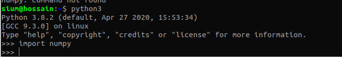

# numpy_tutorial-part-1
<b>Here numpy_tutorial series for beginner.</b> 
<h2>welcome to data_science world using python</h2> 

<h2>you have to install numpy</h2> 

<h1>pip install numpy</h1> 

 
**if you have not any error,you are ready to go** 

*all those exercise exicute in jupyter notebook*

